# Event-Driven Programming Project - Room Management Information System (RMIS)

## Overview
The Room Management Information System (RMIS) is an event-driven web application developed as part of an academic requirement during my third year of college (first semester). The project is designed to streamline the process of room requisitions, making it easier for students to submit requests and for administrators to manage and monitor those requests.

## Project URL
Explore the project using the following link: [Event-Driven Programming Project](http://rmis.ct.ws/)

## Technologies Used
The development of RMIS was accomplished using various web technologies, frameworks, and tools. Below are the key technologies employed:

### **Web Technologies**
- **HTML5**: Defined the structure and layout of web pages for a semantic, accessible, and well-organized interface.
- **CSS3**: Styled the interface to create a responsive and visually appealing design that works across all devices.
- **JavaScript (ES6+)**: Implemented dynamic features, such as real-time form validation and asynchronous data updates, enhancing interactivity.

### **Frontend Frameworks**
- **Tailwind CSS**: Utilized for building responsive layouts with a utility-first approach, ensuring adaptable designs without extensive custom CSS.
- **Bootstrap**: Integrated for pre-designed components, including DataTables for sorting, filtering, and paginating large sets of data like room bookings and user lists.

### **User Experience Libraries**
- **SweetAlert2**: Used to create visually engaging alerts and notifications for user interactions, such as submitting or canceling room requisitions.
- **Chart.js**: Incorporated to visualize key data such as room availability and system usage, allowing admins to make informed decisions quickly.

### **Development Environment**
- **XAMPP**: Facilitated testing and debugging with a local server environment, integrating Apache, MySQL, and PHP for backend and database processes.

### **Database**
- **MySQL**: Used for the backend database to store user data, room requisitions, and other essential information, ensuring efficient data management.

## Architecture
The RMIS is developed using the **Model-View-Controller (MVC)** design pattern, ensuring modularity, scalability, and maintainability. This architectural choice provides a strong foundation for future enhancements.

## Features
- **Room Requisition Forms**: Students can submit room requisition forms for room bookings.
- **Admin Dashboard**: Admins can manage, edit, and delete room requisitions, as well as monitor data analytics through charts.
- **Responsive Design**: The application is fully responsive, providing a seamless user experience across all devices.
- **Data Tables**: Features sorting, filtering, and pagination to manage large sets of data efficiently.

## Admin Dashboard
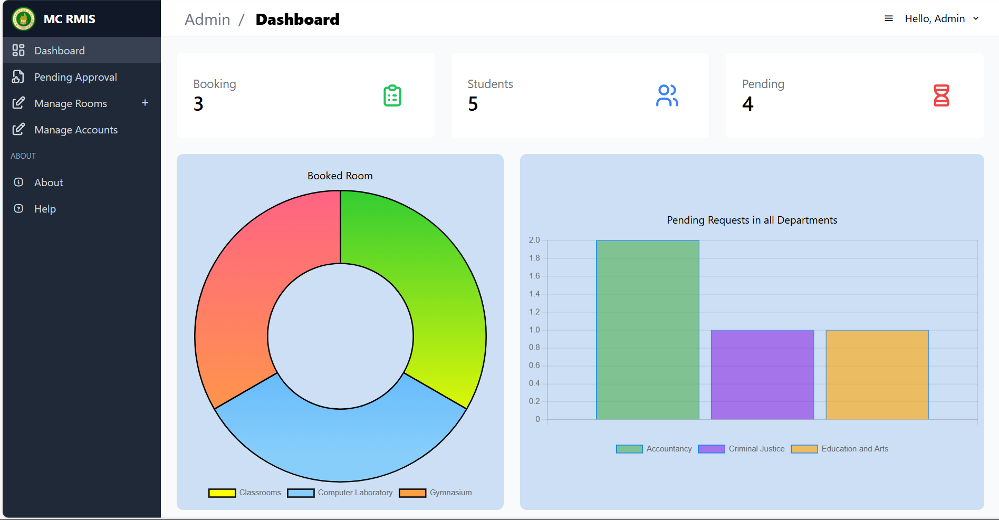
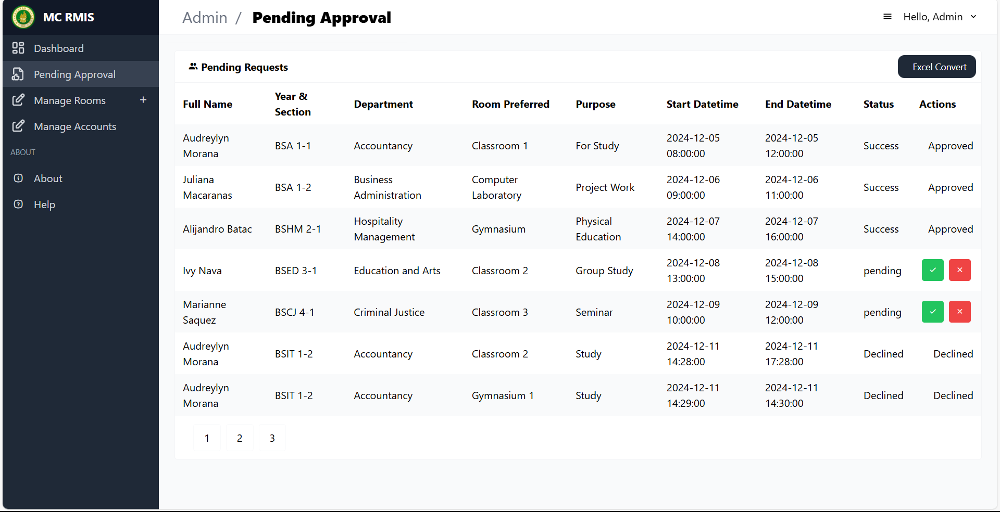
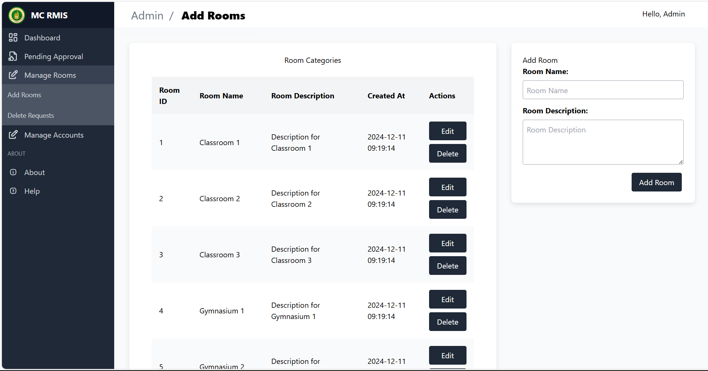
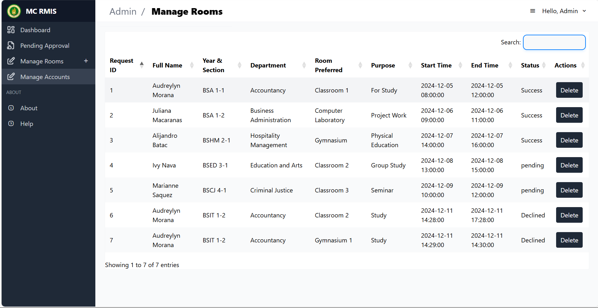
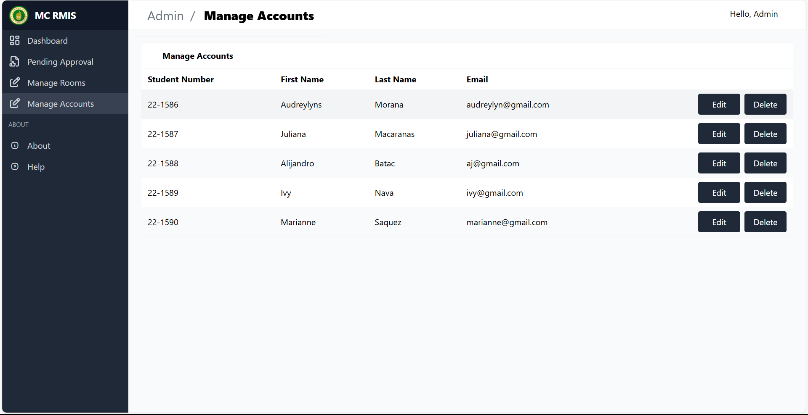

## Student Dashboard
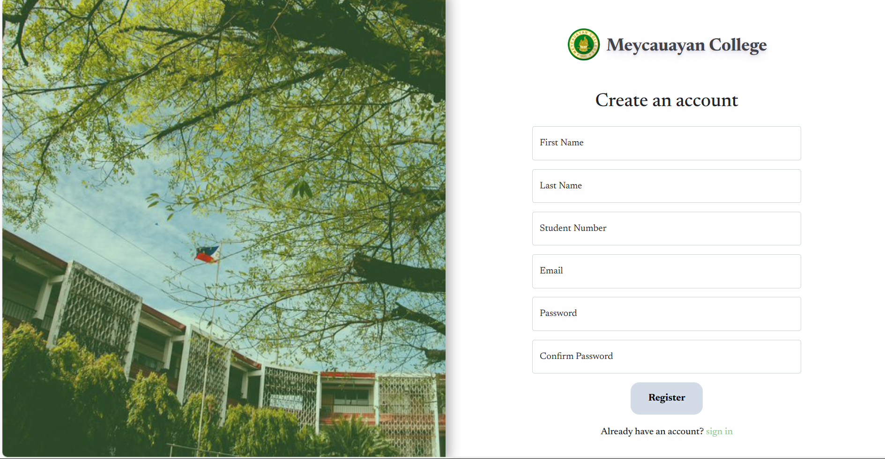
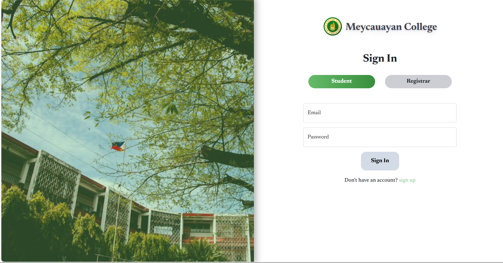
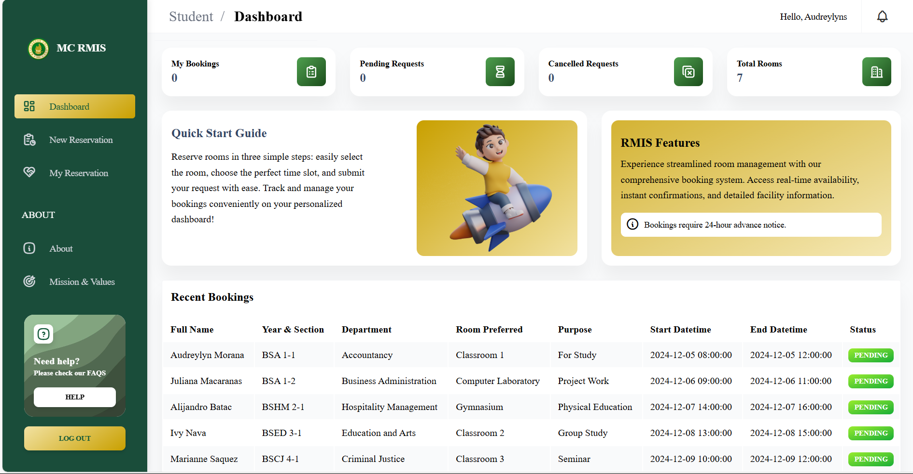
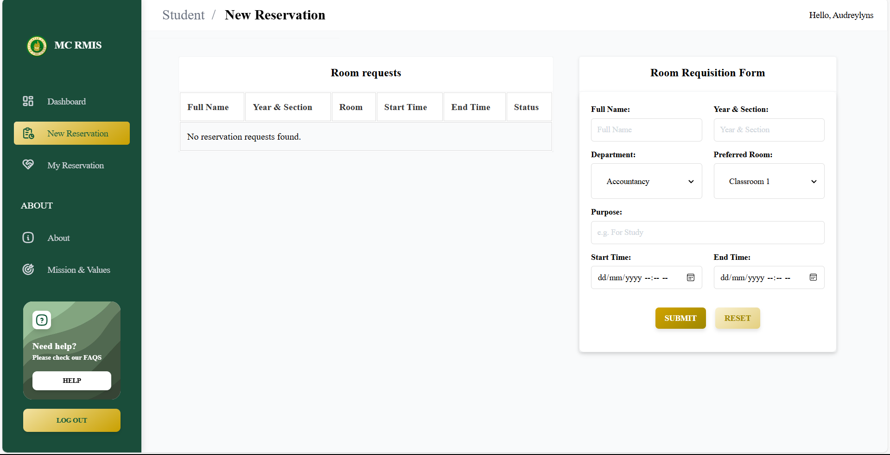
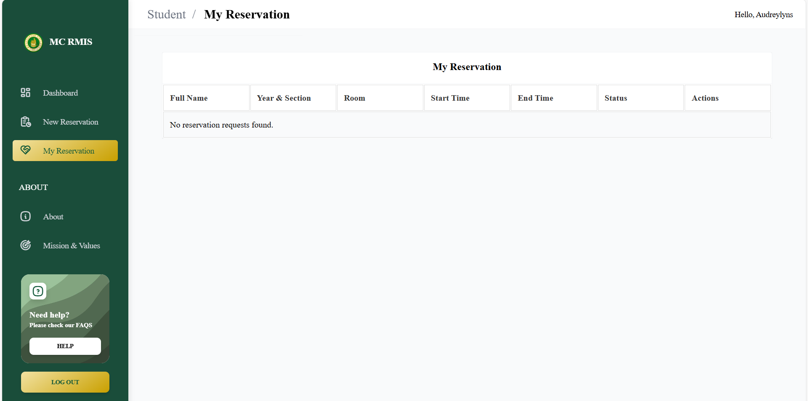
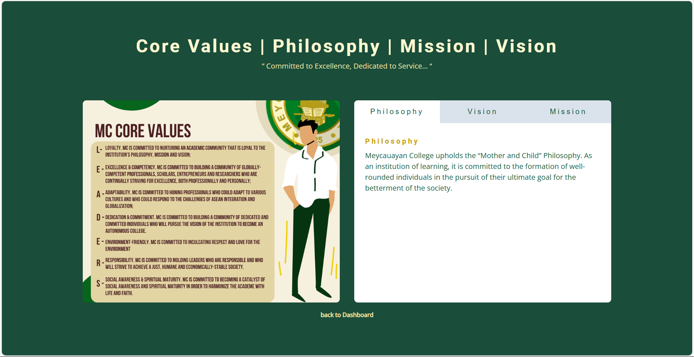
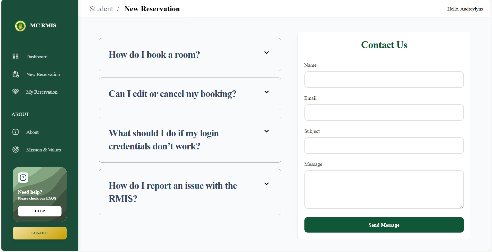 Student / help dapat toh hmp

## Setup and Installation
1. Clone the repository or download the project files.
2. Set up **XAMPP** on your local machine for Apache and MySQL.
3. Import the **MySQL database** from the provided SQL file.
4. Run the application in your local browser.

